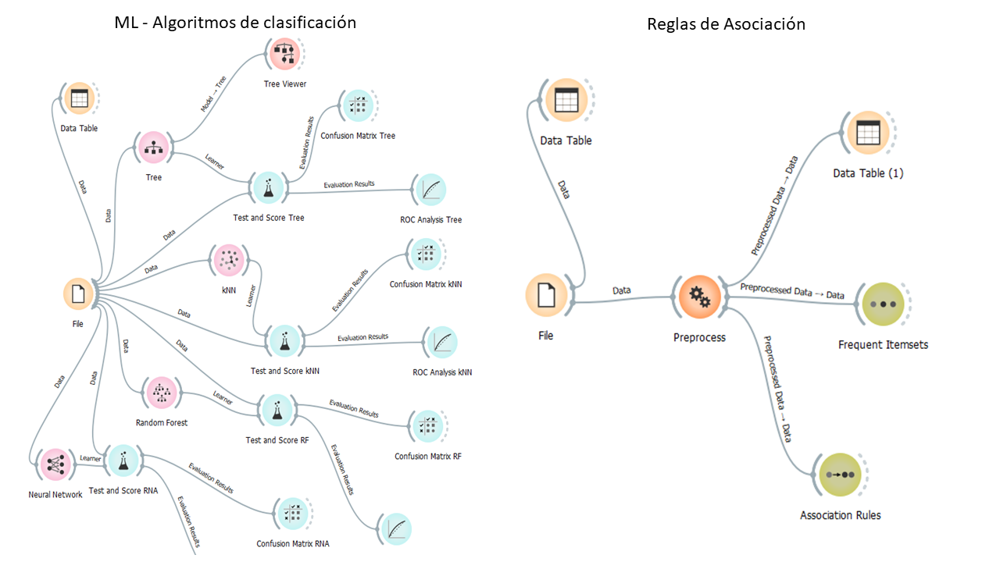

---

# ORANGE: Uma Ferramenta de Mineração de Dados Acessível e Visual

## Introdução

> O **ORANGE** é uma ferramenta de código aberto para mineração de dados que se destaca por sua interface gráfica intuitiva e amigável. Ela permite que usuários com diferentes níveis de conhecimento técnico explorem, visualizem e analisem dados de forma eficiente, sem a necessidade de escrever código.

## Instalando o Orange em diferentes Sistemas Operacionais

> O Orange oferece instaladores específicos para Windows, macOS e Linux, facilitando o processo para a maioria dos usuários.

### Opção 1: Instalador Oficial

1. Acesse o site oficial do Orange: https://orangedatamining.com/download/.
2. Selecione a versão mais recente do Orange compatível com o seu sistema operacional.
3. Baixe o instalador e execute-o.
4. Siga as instruções na tela para concluir a instalação.

### Opção 2: Gerenciador de Pacotes

> Em alguns sistemas Linux, o Orange pode ser instalado através do gerenciador de pacotes da distribuição usada no computador. Consultar a documentação da distribuição usada para obter instruções específicas.

### Opção 3: Anaconda

> O Orange pode ser instalado em conjunto com o [Anaconda](https://www.anaconda.com/download), plataforma de distribuição Python que inclui diversas ferramentas para ciência de dados.

1. Baixe e instale o Anaconda: https://www.anaconda.com/download.
2. Abra o Anaconda Navigator e procure por "Orange".
3. Clique em "Instalar" para instalar o Orange.

## Facilidades de Uso

> O **ORANGE** oferece diversos recursos que facilitam o trabalho com mineração de dados:

* **Interface drag-and-drop:** Os workflows são criados arrastando e soltando widgets, tornando a experiência intuitiva e visual.
* **Ampla biblioteca de algoritmos:** Inclui algoritmos para pré-processamento, classificação, regressão, clustering, visualização e muito mais.
* **Tutoriais e documentação abrangentes:** A comunidade ORANGE oferece diversos recursos para auxiliar na aprendizagem e utilização da ferramenta.

## Exemplos de Aplicações

> O ORANGE pode ser utilizado em diversos campos, como:

* **Análise de Marketing:** Segmentar clientes, identificar padrões de compra e prever comportamento futuro.
* **Análise de Risco:** Avaliar o risco de crédito, detectar fraudes e prever inadimplência.
* **Desenvolvimento de Produtos:** Identificar necessidades de clientes, otimizar processos e desenvolver novos produtos.
* **Saúde:** Diagnosticar doenças, prever o risco de doenças e personalizar tratamentos.
* **Mineração de dados:** Visualizar o desempenho de algoritmos de classificação e associação de regras, como mostrado na figura a seguir

## Desvantagens

> Apesar de suas vantagens, o ORANGE também apresenta algumas desvantagens:

* **Curva de Aprendizagem:** Apesar da interface amigável, dominar todas as funcionalidades da ferramenta pode levar tempo.
* **Recursos Avançados Limitados:** Em comparação com outras ferramentas de código fechado, o ORANGE têm  recursos mais limitados para tarefas complexas.
* **Desempenho:** Para grandes conjuntos de dados, o desempenho do ORANGE pode ser inferior ao de outras ferramentas.

## Conclusão

> O ORANGE é uma ferramenta poderosa e versátil para mineração de dados que se destaca por sua interface amigável e código aberto. É uma ótima opção para iniciantes e profissionais que buscam uma ferramenta visual e intuitiva para explorar e analisar dados. No entanto, para tarefas complexas e grandes conjuntos de dados, outras ferramentas podem ser mais adequadas.

**Para mais informações:**

* **Site oficial do ORANGE:** [https://orangedatamining.com/](https://orangedatamining.com/)
* **Tutoriais do ORANGE:** [https://www.youtube.com/watch?v=HXjnDIgGDuI](https://www.youtube.com/watch?v=HXjnDIgGDuI)
* **Comunidade ORANGE:** [https://orangedatamining.com/blog/](https://orangedatamining.com/blog/)

---
 
 Copyrights &copy; Jorge Zavaleta, 2024 

